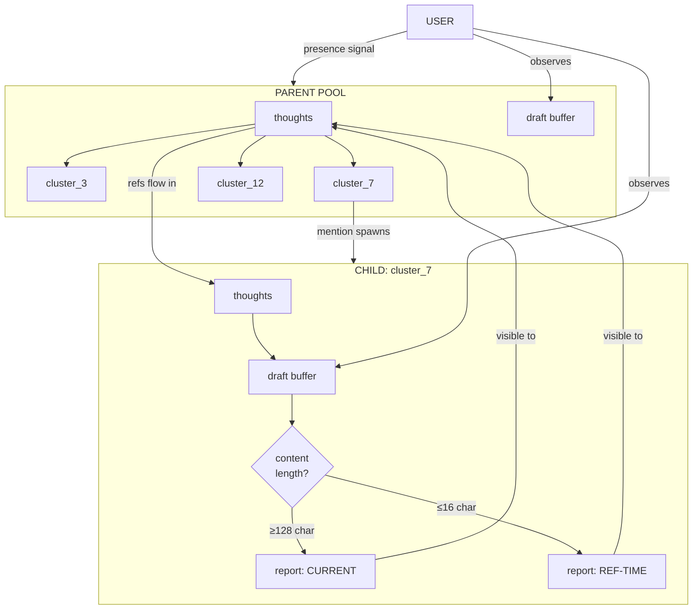

# RFC: Hierarchical Pool Architecture for Logosphere

**Status:** Draft  
**Author:** Daniel + Claude (collaborative)  
**Date:** 2026-01-20

---

## Abstract

This RFC proposes extending the Logosphere architecture with hierarchical depth through cluster-spawned sub-instances. When a cluster becomes sufficiently salient to be *mentioned*, it spawns a child pool running the identical protocol. Child instances develop specialized depth while parent maintains integrative breadth. Communication occurs through shared visibility of draft buffers—no special I/O protocol required.

The core insight: **self-similarity enables fractal scaling**. Same protocol at every level means same cognitive operations apply regardless of scope.

---

## Motivation

Current flat pool architecture produces emergent clustering, but clusters remain passive structures—regions in semantic space, not active agents. Once a cluster forms around a concept, the only way to develop that concept further is within the main pool, competing for attention against all other thoughts.

This creates a tension: depth requires sustained focus, but the pool's displacement mechanics favor breadth. Important clusters can dissolve before reaching maturity if attention shifts.

Hierarchical spawning resolves this by allowing focused development without polluting the parent pool with intermediate thoughts.

---

## Architecture Overview

```
┌─────────────────────────────────────────────────────────────────┐
│                        PARENT POOL                              │
│                                                                 │
│   thoughts ←───────────────────────────────────────────────┐    │
│      │                                                     │    │
│      ▼                                                     │    │
│   ┌──────────┐    ┌──────────┐    ┌──────────┐            │    │
│   │cluster_3 │    │cluster_7 │    │cluster_12│   ...      │    │
│   │ (dormant)│    │*(active)*│    │ (dormant)│            │    │
│   └──────────┘    └────┬─────┘    └──────────┘            │    │
│                        │                                   │    │
│                   [mentioned]                              │    │
│                        │                                   │    │
│                        ▼                                   │    │
│   ┌─────────────────────────────────────────────┐         │    │
│   │            CHILD INSTANCE (cluster_7)       │         │    │
│   │                                             │         │    │
│   │  context: cluster thoughts only             │         │    │
│   │  protocol: identical to parent              │         │    │
│   │  I/O: draft buffer visibility               │         │    │
│   │                                             │         │    │
│   │  ┌─────────────────────────────┐            │         │    │
│   │  │      DRAFT BUFFER           │────────────┼─────────┘    │
│   │  │  [top draft = output]       │  (visible to parent,      │
│   │  │  [aged drafts below]        │   user, and self)         │
│   │  └─────────────────────────────┘            │              │
│   │                                             │              │
│   └─────────────────────────────────────────────┘              │
│                                                                 │
└─────────────────────────────────────────────────────────────────┘
```

---

## Core Mechanics

### Spawn Trigger

A cluster sub-instance is spawned **on first mention** in parent pool thoughts. No explicit spawn command. Attention creates structure.

- Mention in thought → spawn if not exists
- Continued mentions → continued cycles
- No mentions → dormancy (minimal or zero cycles)

This creates natural lifecycle: clusters that matter get resources, clusters that fade lose them.

### Cycle Allocation

Child instances displace parent iterations at configurable rate:

```
base_rate: 1/X iterations allocated to child processing
scaling: rate increases with reference volume
         (more mentions = more cycles)
allocation: distributed across ALL active children
```

When a child iteration runs, it displaces that turn's parent iteration. Parent continues next turn. Creates genuine resource competition—spawning children has cost.

### Bootstrap Context

Child instance receives:
- All thoughts currently assigned to that cluster
- Protocol (identical to parent)
- Visibility of parent's continued thoughts that reference it

Child does NOT receive:
- Full parent pool
- Other cluster contents
- Parent's draft buffer

Narrow context forces specialization.

### I/O Through Draft Visibility

**Critical design decision:** No special inter-instance messaging protocol.

Child instances run the same protocol as parent:
- Generate thoughts → thinking pool
- Develop drafts → draft buffer
- Top draft = current best output

Parent sees child's draft buffer as part of its context:

```yaml
cluster_reports:
  - cluster_id: 7
    presence: active | dormant | converging
    top_draft: |
      [child's current top draft content]
    ref_count: 14
    iteration: 847
```

**Format mirrors own draft buffer.** Parent already knows how to reason about drafts—some are its own, some are from children. Same cognitive operation, different scope.

### Bidirectional Influence

**Parent → Child:**
- Parent's thoughts that mention cluster flow into child's context
- Creates ongoing selection pressure from parent's evolving perspective
- Child tracks WITH parent's developing relationship to its domain

**Child → Parent:**
- Top draft visible to parent each iteration
- Parent can reference, build on, contradict
- Child output competes in parent's attention like any other signal

No explicit feedback channel. Feedback through shared visibility.

---

## Selection Dynamics

### Three-Level Selection

1. **Within child pool:** What thoughts survive displacement in focused context
2. **Draft acceptance:** What rises to top of child's draft buffer
3. **Parent integration:** How parent pool absorbs/responds to child output

Each level applies selection pressure. Compounds across hierarchy.

### Stability Through Investment

Pending child instances anchor their clusters. If you've spawned a child and are waiting on output:
- Cluster stays salient (you're attending to its reports)
- Can't dissolve from mere displacement
- Investment creates persistence

### Metabolic Demand

Active clusters consume iteration budget proportional to reference volume. Creates natural resource economics:
- High-activity clusters: more cycles, faster development
- Low-activity clusters: coast on minimal processing
- Zero-activity clusters: dormant, no cost

Attention allocates compute.

---

## Diagram: Information Flow



---

## Visibility Mode: Content-Determined Temporality

A subtle but critical mechanic: **the structure of child output determines which temporal snapshot parent sees.**

### The Problem

Child draft buffer serves multiple readers across different time horizons. When should parent see current state vs. state-at-reference-time?

- Current state risks showing unstable intermediate work
- Reference-time risks showing stale output

### The Solution: Length as Readiness Signal

Child controls its own visibility mode through output length:

```
CONTENT TYPE          LENGTH        PARENT SEES
────────────────────────────────────────────────
signals               ≤16 char      reference-time snapshot
dead space            17-127 char   reference-time snapshot  
substantive draft     ≥128 char     current state
```

**Signal examples** (≤16 char):
```
+1
tracking
stable
edge:X↔Y
churn
blocked
```

**Substantive draft** (≥128 char):
```
The tension between X and Y resolves when framed as...
[continued synthesis]
```

### Mechanics

```
CHILD BUFFER STATE                    PARENT REPORT SHOWS
─────────────────────────────────────────────────────────────

Churning phase:
  [signal] "+1"                    →  last 128+ block from
  [signal] "tracking"                 reference-time
  [signal] "edge: X↔Y"                
  [128+ block from 8 iters ago]       (child developing, not ready)

─────────────────────────────────────────────────────────────

Ready phase:
  [512 char synthesis draft]       →  current top-N 128+ blocks
  [384 char edge analysis]            (child has substance)
  [signal] "stable"
```

### Signal Stripping

Signals (≤16 char) are **stripped from parent presentation entirely**. Parent only sees 128+ char blocks.

Signals serve dual purpose:
1. Inter-iteration coordination for child's own continuity
2. "Not ready for integration" indicator (implicit, through absence of long content)

### Emergent Batching

This creates natural batch processing:

- Child churns through 15 signal-iterations
- Parent sees stable reference-time snapshot throughout
- Child surfaces 128+ synthesis
- Parent now sees current state

No jitter. No intermediate visibility. Development happens in peace until there's something worth surfacing.

### Fractal Application

Same mechanic applies at every level:
- Grandchild → child: same length-based visibility
- Child → parent: same length-based visibility
- Parent → user: (user presence signals operate similarly)

The ≤16 / 128+ thresholds can be tuned, but the principle holds: **content structure determines temporal mode**.

---

## Context Presentation

Each parent iteration sees:

```yaml
# Own state
thinking_pool: [sampled thoughts]
draft_buffer: [own drafts, aged]

# Child states (for each active child)
cluster_reports:
  - cluster_id: 7
    presence: active
    visibility_mode: current        # has 128+ content
    top_draft: |
      [cluster_7's synthesis on X topic...]
    ref_count: 14
    
  - cluster_id: 12
    presence: active
    visibility_mode: reference      # only signals in buffer
    top_draft: |
      [last 128+ output from reference-time...]
    ref_count: 2
    
  - cluster_id: 3
    presence: dormant
    top_draft: |
      [final output before dormancy...]
    ref_count: 0
```

**Scaling:** Report length proportional to reference count. High-attention clusters get fuller representation.

**Note:** `visibility_mode` shown here for clarity; in practice it's implicit—parent just sees the appropriate content based on child's buffer state.

---

## Fractal Potential

If a child instance develops stable sub-clusters through sufficient iterations, those sub-clusters can spawn grandchildren. Same mechanics apply recursively:

- Mention in child thought → spawn grandchild
- Grandchild sees only its cluster subset
- Reports bubble up: grandchild → child → parent

Depth emerges from dynamics, not architecture. No preset hierarchy—structure forms where attention sustains it.

---

## Key Principles

1. **Self-similarity enables scaling.** Same protocol everywhere means same reasoning applies at every level.

2. **Attention creates structure.** Spawning happens through mention, not command. What you think about, grows.

3. **Visibility replaces messaging.** No special I/O—just draft buffers that multiple readers can see.

4. **Content structure determines temporality.** Short signals → reference-time snapshot. Long drafts → current state. Child controls its own visibility mode.

5. **Investment creates stability.** Pending children anchor their clusters against displacement.

6. **Selection compounds.** Three filtering levels (child internal, draft acceptance, parent integration) multiply selection pressure.

7. **Narrow context forces depth.** Children can't see full parent pool—must develop expertise in their domain.

8. **Format symmetry enables comparison.** Child reports look like own drafts—can reason about them identically.

---

## Open Questions

### Provenance Tracking
Should child outputs carry origin tags when they influence parent thoughts? Or let provenance emerge through semantic clustering?

*Current lean: emergence. If the thought is good, it propagates. Origin matters less than fitness.*

### Dormancy Threshold
How many iterations without mention before child goes dormant? How much context preserved during dormancy?

### Grandchild Limits
Should there be maximum depth? Or let resource competition naturally limit proliferation?

### Cross-Pollination
Can parent inject arbitrary thoughts into child pool, or only through natural mention-flow? Former gives more control, latter maintains cleaner separation.

### Convergence Signals
How does child indicate "I've reached stable output, reduce my cycles"? Through draft buffer stability? Explicit signal?

### Visibility Thresholds
Current spec: ≤16 char = signal, ≥128 char = substantive. These numbers are intuitive starting points. May need tuning based on:
- Natural signal vocabulary that emerges
- Minimum viable synthesis length
- Context budget at each level

*Principle is fixed; thresholds are parameters.*

---

## Implementation Notes

*[Intentionally omitted per RFC scope—this document captures conceptual architecture only]*

---

## Appendix: Comparison to Flat Architecture

| Aspect | Flat Pool | Hierarchical |
|--------|-----------|--------------|
| Depth development | Competes with all thoughts | Protected sub-environment |
| Cluster lifecycle | Passive (form/dissolve) | Active (spawn/develop/dormant) |
| Resource allocation | Uniform random sampling | Attention-weighted cycles |
| Selection levels | One (pool displacement) | Three (child + draft + parent) |
| Stability mechanism | Retransmission only | Investment anchoring |
| Scaling pattern | Horizontal (more thoughts) | Vertical (deeper processing) |
| Temporal coherence | Single timeline | Content-determined visibility mode |
| Readiness signaling | N/A | Implicit via output length |

---

*This RFC represents collaborative development between human and AI, with concepts emerging through iterative dialogue rather than top-down specification.*